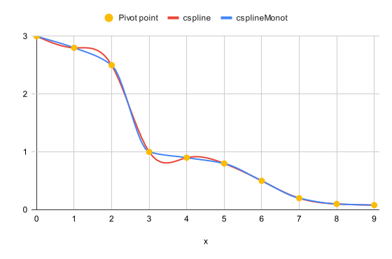

# numeric-wrench 🔧 [](https://github.com/smikhalevski/numeric-wrench/actions/workflows/master.yml)

Number manipulation and math functions.

```shell
npm install --save-prod numeric-wrench
```

⚠️ [API documentation is available here.](https://smikhalevski.github.io/numeric-wrench/)

# Usage

### `cspline` / `csplineMonot`

Returns a cubic spline interpolation function for given pivot points:

```ts
const f = cspline(xs, ys);
const y = f(x);
```

More control over spline caching and computation:

```ts
const y = interpolateCSpline(
    xs, // The array of X coordinates of pivot points in ascending order
    ys, // The array of corresponding Y coordinates of pivot points
    x,  // The X coordinate of interpolated point
    xs.length, // The number of pivot points to use
    createCSplines(xs, ys, xs.length), // The array of spline components
);
```

Values produced by `cspline` aren't guaranteed to be monotonous and not [overshoot](https://en.wikipedia.org/wiki/Overshoot_(signal)) the pivot points.

To prevent overshooting, use `csplineMonot`:

```ts
const f = csplineMonot(xs, ys);
const y = f(x);
```

Or interpolate using more fine-grained approach:

```ts
const y = interpolateCSplineMonot(xs, ys, x, xs.length, createCSplinesMonot(xs, ys, xs.length));
```

The plot below shows that `cspline` interpolation overshoots pivot points while `csplineMonot` provides monotonous results.



### `parallelSort`

Non-recursive quicksort algorithm implementation aimed for sorting multiple arrays in parallel.

```ts
parallelSort(
    arr, // Mutable array that would be sorted
    (i, j) => {
      // Called when i and j elements of arr were swapped
      // Use this to swap elements in any other array
    },
    (a, b) => {
      // Compare a and b elements of arr
      return asc(a, b);
    },
);
```

### `left` / `right` / `xor` / `or` / `and`

Bitwise operations for integers that exceed numbers 32-bit range:

```ts
left(0xAB, 8); // Same as 0xAB << 8
// → 0xAB_00 

left(0xAB_CD_EF_AB_CD, 24)
// → 0xAB_CD_EF_AB_CD_00_00_00
```
